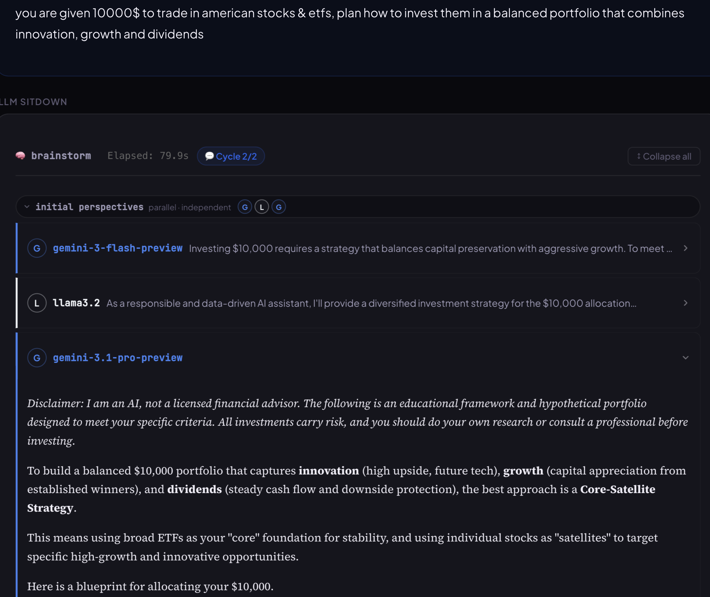
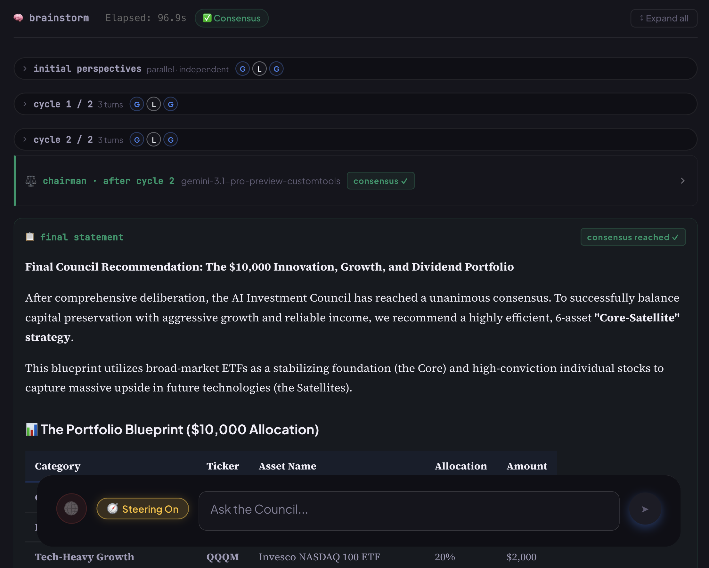
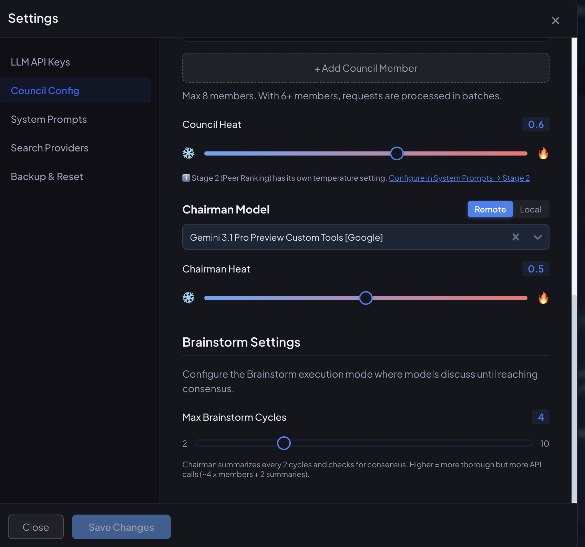

# LLM Sitdown


> **Multi-LLM deliberation framework where models debate in structured cycles until they reach consensus — or agree to disagree.**

[](https://www.python.org/downloads/)
[](https://reactjs.org/)
[](https://fastapi.tiangolo.com/)
[](https://opensource.org/licenses/MIT)

---

## What is LLM Sitdown?

Most "multi-LLM" tools poll several models in parallel and pick a winner. **LLM Sitdown** does something different: it sits the models down at the same table and makes them talk to each other.

A council of LLMs takes turns reading the full discussion and contributing new perspectives. Every couple of cycles a Chairman model summarizes where things stand, flags disagreements, and weighs in. You can interject mid-conversation to steer the debate. The discussion ends when the council converges on consensus — or when the cycle limit is reached and the Chairman calls it.

The result is a deliberation, not a vote: more thoroughly stress-tested answers for the questions where a single model's first instinct isn't good enough.

---



## Installation

```bash
# Clone and install
git clone https://github.com/YOUR_USERNAME/llm-sitdown.git
cd llm-sitdown
uv sync                    # Backend dependencies
cd frontend && npm install # Frontend dependencies

# Run (from project root)
./start.sh
```

Then open **http://localhost:5173** and configure your API keys in Settings.

> **Prerequisites:** Python 3.10+, Node.js 18+, [uv](https://docs.astral.sh/uv/)

---

## How the Sitdown Works

```
┌─────────────────────────────────────────────────────────────────┐
│                        YOUR QUESTION                             │
└─────────────────────────────────────────────────────────────────┘
                              │
                              ▼
┌─────────────────────────────────────────────────────────────────┐
│                     INITIAL PERSPECTIVES                         │
│  Each model answers independently (no coordination yet)          │
└─────────────────────────────────────────────────────────────────┘
                              │
                 ┌────────────▼────────────┐
                 │     DISCUSSION CYCLES    │
                 │                          │
                 │  ► Each model reads the  │
                 │    full conversation and │
                 │    adds its perspective  │
                 │                          │
                 │  ► Chairman summarizes   │◄── (optional)
                 │    every 2 cycles and    │    User Steering
                 │    checks for consensus  │    Input
                 │                          │
                 │  ► Loop until consensus  │
                 │    or the cycle limit is │
                 │    reached. At the limit │
                 │    without consensus,    │
                 │    you can extend by +2  │
                 │    cycles or finalize    │
                 └────────────┬────────────┘
                              │
                              ▼
┌─────────────────────────────────────────────────────────────────┐
│                    FINAL SYNTHESIS                               │
│  Chairman drafts a definitive statement based on the full        │
│  discussion, all summaries, and any user steering inputs         │
└─────────────────────────────────────────────────────────────────┘
```

**The flow:**

1. Each model submits an independent initial perspective
2. Models take turns in round-robin order, each one reading the conversation so far and contributing an updated perspective
3. After every 2 cycles, the Chairman summarizes the debate — noting agreements, flagging open disagreements, and sharing its own view to guide the next round
4. If the Chairman signals `CONSENSUS: YES`, the discussion ends early
5. If the cycle limit is hit without consensus, you choose: **extend** the discussion by +2 cycles (with an optional steering pause) or **finalize** now and let the Chairman call it. You can keep extending as many times as you like.
6. After consensus or finalization, the Chairman drafts a definitive final statement

**Cycle limit:** Configurable per install in Council Configuration (2–10, default 4). The Chairman summarizes every 2 cycles, so the limit is best set as an even number.

**User Steering:** Enable the steering toggle to pause between cycles and inject your own guidance — redirect the conversation, focus on a subtopic, or introduce a new angle. The backend waits up to 5 minutes per pause; skip it and the discussion continues automatically.

---



## Features

### Multi-Provider Support

Mix and match models from different sources in your council:

| Provider | Type | Description |
|----------|------|-------------|
| **OpenRouter** | Cloud | 100+ models via single API (GPT-4, Claude, Gemini, Mistral, etc.) |
| **Ollama** | Local | Run open-source models locally (Llama, Mistral, Phi, etc.) |
| **Groq** | Cloud | Ultra-fast inference for Llama and Mixtral models |
| **OpenAI Direct** | Cloud | Direct connection to OpenAI API |
| **Anthropic Direct** | Cloud | Direct connection to Anthropic API (with auto-retry on rate limits) |
| **Google Direct** | Cloud | Direct connection to Google AI API |
| **Mistral Direct** | Cloud | Direct connection to Mistral API |
| **DeepSeek Direct** | Cloud | Direct connection to DeepSeek API |
| **Custom Endpoint** | Any | Connect to any OpenAI-compatible API (Together AI, Fireworks, vLLM, LM Studio, GitHub Models, etc.) |

<p align="center">
  
</p>

### Web Search Integration

<p align="center">
  
</p>

Ground your council's responses in real-time information:

| Provider | Type | Notes |
|----------|------|-------|
| **DuckDuckGo** | Free | Hybrid web+news search, no API key needed |
| **Serper** | API Key | Real Google results, 2,500 free queries |
| **Tavily** | API Key | Purpose-built for LLMs, rich content |
| **Brave Search** | API Key | Privacy-focused, 2,000 free queries/month |

**Full Article Fetching**: Uses [Jina Reader](https://jina.ai/reader) to extract full article content from top search results (configurable 0–10 results).

### Temperature Controls

Fine-tune creativity vs consistency:

- **Council Heat**: Controls initial-perspective and discussion-turn creativity (default: 0.5)
- **Chairman Heat**: Controls summaries and final-synthesis creativity (default: 0.4)

<p align="center">
  
</p>
<p align="center">
  
</p>



### Additional Features

- **Live Progress Tracking**: See each model respond in real-time
- **Retry Last Message**: One-click retry for failed or unsatisfying responses
- **Council Sizing**: Adjust council size from 2 to 8
- **Abort Anytime**: Cancel in-progress requests
- **Conversation History**: All conversations saved locally (including full discussion turn/summary history)
- **Customizable Prompts**: Edit Initial Response, Discussion Turn, Summary, and Final Statement system prompts
- **Anthropic Rate-Limit Retry**: Automatic exponential backoff on 429 errors, respecting `Retry-After` headers
- **GFM Table Support**: GitHub-flavored Markdown tables rendered correctly via `remark-gfm`
- **Rate Limit Warnings**: Alerts when your config may hit API limits (when >5 council members)
- **"I'm Feeling Lucky"**: Randomize your council composition
- **Import & Export**: Backup and share your favorite council configurations, system prompts, and settings

<p align="center">
  
</p>

---

## Quick Start

### Prerequisites

- **Python 3.10+**
- **Node.js 18+**
- **[uv](https://docs.astral.sh/uv/)** (Python package manager)

### Running the Application

**Option 1: Use the start script (recommended)**
```bash
./start.sh
```

**Option 2: Run manually**

Terminal 1 (Backend):
```bash
uv run python -m backend.main
```

Terminal 2 (Frontend):
```bash
cd frontend
npm run dev
```

Then open **http://localhost:5173** in your browser.

### Network Access

The application is accessible from other devices on your local network.

**Using start.sh (automatic):** The start script exposes both frontend and backend on the network automatically.

**Access URLs:**
- **Local:** `http://localhost:5173`
- **Network:** `http://YOUR_IP:5173` (e.g., `http://192.168.1.100:5173`)

**Find your network IP:**
```bash
# macOS/Linux
ifconfig | grep "inet " | grep -v 127.0.0.1
```

**Manual setup (if not using start.sh):**
```bash
# Backend already listens on 0.0.0.0:8001
cd frontend && npm run dev -- --host
```

---

## Configuration

### First-Time Setup

On first launch, the Settings panel will open automatically. Configure at least one LLM provider:

1. **LLM API Keys** tab: Enter API keys for your chosen providers
2. **Council Config** tab: Select council members and chairman
3. **Save Changes**

### LLM API Keys

| Provider | Get API Key |
|----------|-------------|
| OpenRouter | [openrouter.ai/keys](https://openrouter.ai/keys) |
| Groq | [console.groq.com/keys](https://console.groq.com/keys) |
| OpenAI | [platform.openai.com/api-keys](https://platform.openai.com/api-keys) |
| Anthropic | [console.anthropic.com](https://console.anthropic.com/) |
| Google AI | [aistudio.google.com/apikey](https://aistudio.google.com/apikey) |
| Mistral | [console.mistral.ai/api-keys](https://console.mistral.ai/api-keys/) |
| DeepSeek | [platform.deepseek.com](https://platform.deepseek.com/) |

**API keys are auto-saved** when you click "Test" and the connection succeeds.

### Ollama (Local Models)

1. Install [Ollama](https://ollama.com/)
2. Pull models: `ollama pull llama3.1`
3. Start Ollama: `ollama serve`
4. In Settings, enter your Ollama URL (default: `http://localhost:11434`)
5. Click "Connect" to verify

### Custom OpenAI-Compatible Endpoint

Connect to any OpenAI-compatible API:

1. Go to **LLM API Keys** → **Custom OpenAI-Compatible Endpoint**
2. Enter:
   - **Display Name**: e.g., "Together AI", "My vLLM Server"
   - **Base URL**: e.g., `https://api.together.xyz/v1`
   - **API Key**: (optional for local servers)
3. Click "Connect" to test and save

**Compatible services**: Together AI, Fireworks AI, vLLM, LM Studio, Ollama, GitHub Models (`https://models.inference.ai.azure.com/v1`), and more.

### Council Configuration

1. **Enable Model Sources**: Toggle which providers appear in model selection
2. **Select Council Members**: Choose 2–8 models for your council
3. **Select Chairman**: Pick a model to summarize cycles and synthesize the final answer
4. **Adjust Temperature**: Use the Council Heat and Chairman Heat sliders for creativity control
5. **Max Discussion Cycles**: Set the initial cycle ceiling (2–10, default 4). The Chairman summarizes every 2 cycles and checks for consensus. If the council still hasn't agreed once the limit is reached, you'll be prompted to either extend by +2 cycles or have the Chairman issue the final statement immediately.

**Tips:**
- Mix different model families for diverse perspectives
- Use faster models (Groq, Ollama) for large councils
- The sitdown works best with 3–5 council members — too many makes cycles slow
- Free OpenRouter models have rate limits (20/min, 50/day)

### Search Providers

| Provider | Setup |
|----------|-------|
| DuckDuckGo | Works out of the box, no setup needed |
| Serper | Get key at [serper.dev](https://serper.dev), enter in Search Providers tab |
| Tavily | Get key at [tavily.com](https://tavily.com), enter in Search Providers tab |
| Brave | Get key at [brave.com/search/api](https://brave.com/search/api/), enter in Search Providers tab |

**Search Query Processing:**

| Mode | Description | Best For |
|------|-------------|----------|
| **Direct** (default) | Sends your exact query to the search engine | Short, focused questions |
| **Smart Keywords (YAKE)** | Extracts key terms before searching | Very long prompts or complex multi-paragraph inputs |

---

## Usage

### Basic Usage

1. Start a new conversation (+ button in sidebar)
2. Type your question
3. (Optional) Enable web search toggle for real-time info
4. Press Enter or click Send

### The Sitdown, step by step

1. Send your question — models will answer independently first
2. Watch the discussion panel as models take turns building on each other's responses
3. After every 2 cycles, the Chairman posts a summary noting agreements and open questions
4. (Optional) Enable **User Steering** to pause between cycles and inject guidance
5. If the cycle limit hits without consensus, choose **➕ 2 more cycles** to keep deliberating (you can do this repeatedly) or **📋 Issue final statement** to wrap up now
6. When discussion ends (consensus or finalize), the Chairman drafts the final statement

### What you'll see

- **Initial Perspectives**: A collapsible panel with each model's independent first answer
- **Cycle Cards**: Expandable cards for each round, with every model's turn labeled by name and cycle
- **Chairman Summaries**: Dividers between cycles showing consensus status (`CONSENSUS: YES/NO`) and open questions
- **Steering Input**: Toast prompt between cycles when User Steering is enabled
- **Extend-or-Finalize Toast**: At the cycle limit without consensus, a toast offers `➕ 2 more cycles` (with an optional steering pause before they start) or `📋 Issue final statement`
- **Final Statement**: Chairman's definitive answer once the discussion concludes
- **Chairman Follow-up Chat**: Continue the conversation with the Chairman after the sitdown ends

### Keyboard Shortcuts

| Key | Action |
|-----|--------|
| `Enter` | Send message |
| `Shift+Enter` | New line in input |

---

## Tech Stack

| Component | Technology |
|-----------|------------|
| **Backend** | FastAPI, Python 3.10+, httpx (async HTTP) |
| **Frontend** | React 19, Vite, react-markdown, remark-gfm |
| **Styling** | CSS with "Midnight Glass" dark theme |
| **Storage** | JSON files in `data/` directory |
| **Package Management** | uv (Python), npm (JavaScript) |

---

## Data Storage

All data is stored locally in the `data/` directory:

```
data/
├── settings.json          # Your configuration (includes API keys)
└── conversations/         # Conversation history
    ├── {uuid}.json
    └── ...
```

**Privacy**: No data is sent to external servers except API calls to your configured LLM providers.

> **⚠️ Security Warning: API Keys Stored in Plain Text**
>
> API keys are stored in clear text in `data/settings.json`. The `data/` folder is included in `.gitignore` by default.
>
> - **Do NOT remove `data/` from `.gitignore`**
> - Never commit `data/settings.json` to version control
> - If you accidentally expose your keys, rotate them immediately

---

## Troubleshooting

### Common Issues

**"Failed to load conversations"**
- Backend might still be starting up; app retries automatically (3 attempts with 1s, 2s, 3s delays)

**Models not appearing in dropdown**
- Ensure the provider is enabled in Council Config
- Check that API key is configured and tested successfully
- For Ollama, verify connection is active

**Discussion gets stuck / times out**
- The backend waits up to 5 minutes for steering input per pause, then auto-skips
- If User Steering is enabled and you step away, discussion resumes automatically

**Jina Reader returns 451 errors**
- HTTP 451 = site blocks AI scrapers (common with news sites)
- Try Tavily/Brave instead, or set `full_content_results` to 0

**Rate limit errors (OpenRouter)**
- Free models: 20 requests/min, 50/day
- Use Groq or Ollama for large councils to keep cycle latency manageable

**Anthropic 429 rate limit errors**
- The Anthropic provider auto-retries up to 3 times with exponential backoff, respecting `Retry-After` / `Retry-After-Ms` headers

**Binary compatibility errors (node_modules)**
```bash
rm -rf frontend/node_modules && cd frontend && npm install
```

### Logs

- **Backend logs**: Terminal running `uv run python -m backend.main`
- **Frontend logs**: Browser DevTools console

---

## Credits & Lineage

LLM Sitdown stands on the shoulders of two earlier projects:

- **[llm-council](https://github.com/karpathy/llm-council)** by **[Andrej Karpathy](https://github.com/karpathy)** — the original concept of polling multiple LLMs and having them peer-review one another.
- **[llm-council-plus](https://github.com/jacob-bd/llm-council-plus)** by **[Jacob BD](https://github.com/jacob-bd)** — a substantial extension of the original with multi-provider support, web search integration, customizable prompts, conversation history, and the polished React/FastAPI UI that this project inherits.

**What LLM Sitdown adds on top:**
- **Round-robin council deliberation** — replaces parallel polling with a structured multi-cycle discussion: each model reads the full conversation and contributes a fresh perspective per turn, with chairman summaries and consensus detection every 2 cycles
- **Mid-discussion user steering** — interject between cycles to redirect the conversation
- **Retry Last Message** — one-click retry for failed or unsatisfying responses
- **Anthropic rate-limit retry** — header-aware exponential backoff
- **GFM table rendering** in all markdown outputs

Sincere thanks to both Andrej and Jacob — without their work, this project wouldn't exist.

---

## License

MIT License — see [LICENSE](LICENSE) for details.

---

## Contributing

Contributions are welcome. The project is still evolving, especially around the deliberation mechanic — ideas for better consensus detection, alternative chairman strategies, or new steering primitives are particularly appreciated.

---

<p align="center">
  <strong>Sit the models down. Let them argue. Get a better answer.</strong>
</p>
